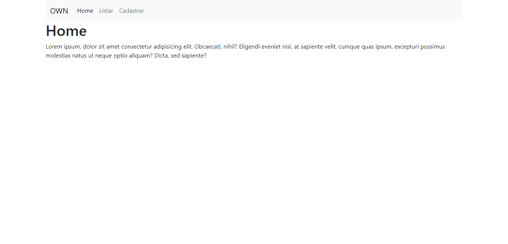
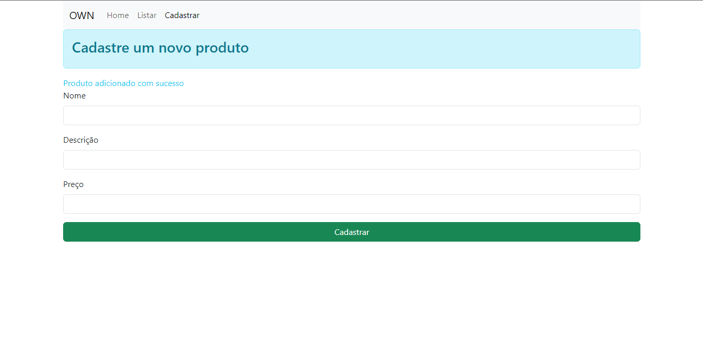
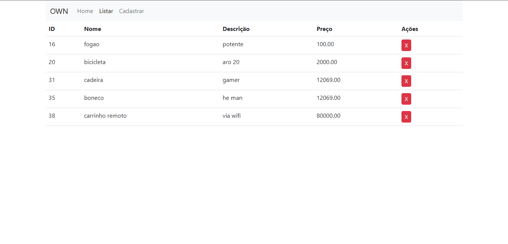

<h5>Projeto feito no intuito de conhecer melhor o PHP; criar minha propria gambiarra e vê como realmente funciona.</h5>

A fim de ter a experiência de criar um servidor cru e do zero.

<h2>Home</h2>

<h2>Cadastro</h2>

<strong>flash message</strong>

<h2>listagem</h2>

